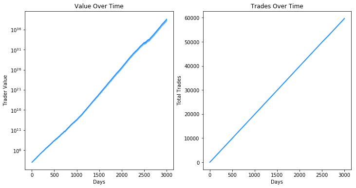
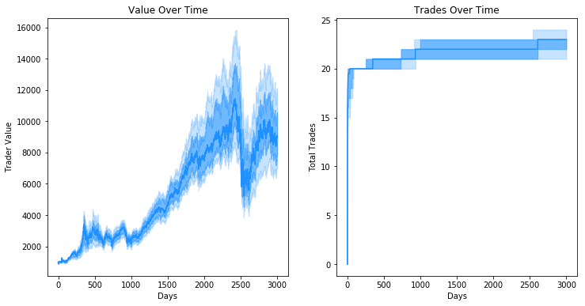

# EvoTrading

This repository contains trading agents that use sets of rules to decide when to buy and sell stocks. The rules can be set
manually. Alternatively, a population of rule-based traders can be evolved to maximise returns. Historical NASDAQ stock prices
were used to test and evolve sets of trading rules.

## Contents

`markets.py`

Definitions of stock market classes. Each stock market uses historical NASDAQ prices for up to 388 different stocks from roughly
1998 to 2010. Prices are dividend adjusted. Each stock market is initialised with a start day (0-3925), a number of stocks (1-388)
and a transaction cost (>= 0). The `Market` class uses unaltered stock prices. The `NoisyMarket` class takes an additional noise
argument and uses stock prices with multiplicative noise, i.e. noisy price = price x u, where u ~ Uniform(1 - noise/2, 1 + noise/2).

`traders.py`

Definitions of standard trader classes. There is a `BuyAndHoldTrader` that spends an equal amount on every available stock.
There is a `CustomTrader` class that uses rules for deciding which stocks to buy and sell. It is initialised with a balance, a
number of stocks (for the market it will be trading in), a number of positions, buy filters, a buy ranking, sell filters and an emergency sell argument. The custom trader always spends (1 / number of positions) on each stock it buys. Each stock is screened
with a set of buy filters. Any that pass will be bought if there are open positions. The buy ranking is used to decide which stocks
to buy if more stocks pass the buy filters than there are open positions. The custom trader uses sell filters to decide which stocks
to sell. In addition, the custom trader maintains the highest price that each stock it is holding has hit since it bought them. If
the price of any stock falls below (high x (1 - emergency sell) x 100), it will sell it, ignoring the sell filters.

`genetic_traders.py`

Definitions of buy filters, sell filters, buy rankings and an evolvable trader. The `GeneticTrader` class is more or less the
same as the `CustomTrader` class, except it is initialised with a `TraderGenome`. The `TraderGenome` class is essentially just a
collection of buy filters, a buy ranking, sell filters and an emergency sell parameter with methods for mutation and crossover.
There is a `TraderPopulation` class that evolves following a genetic algorithm. At the end of the evolution, the best trader genome
can be obtained.

## Testing

Sets of rules for a trading agent were evolved for two scenarios. In each case, the evolution was done with the `trader_evolution.py`
file. Plots of the evolved traders' balances and numbers of trades over time were done with the `trader_test.py` file. In the
first scenario, there was no cost for buying or selling a stock. The returns and number of trades for this trader assuming no transaction costs are shown below.

  

In the second scenario, there was an £8 cost for buying or selling any amount of a stock. The returns and number of trades for this
trader assuming £8 transaction costs are shown below.

  

